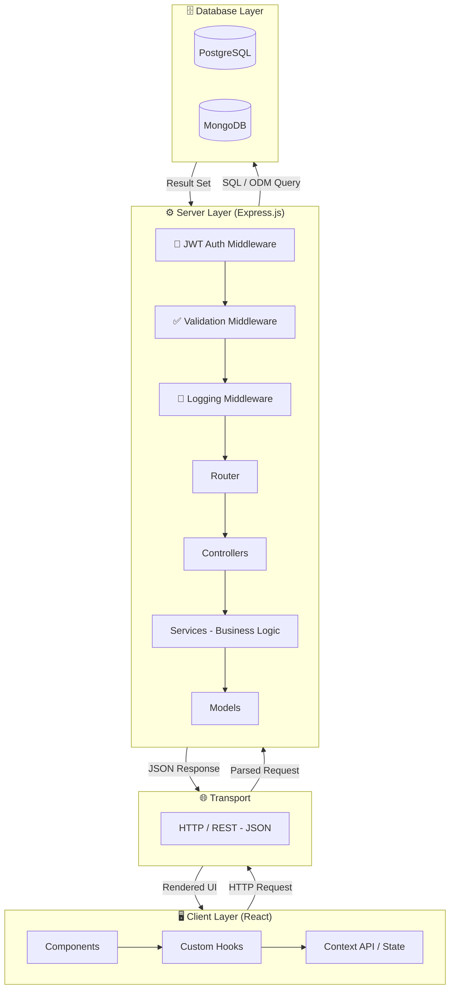
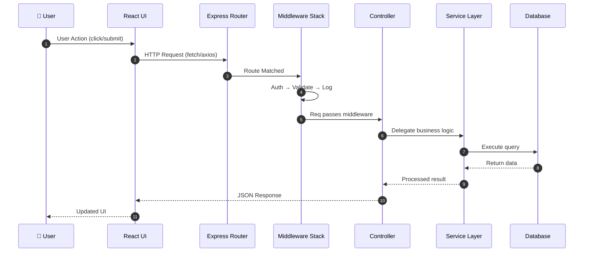
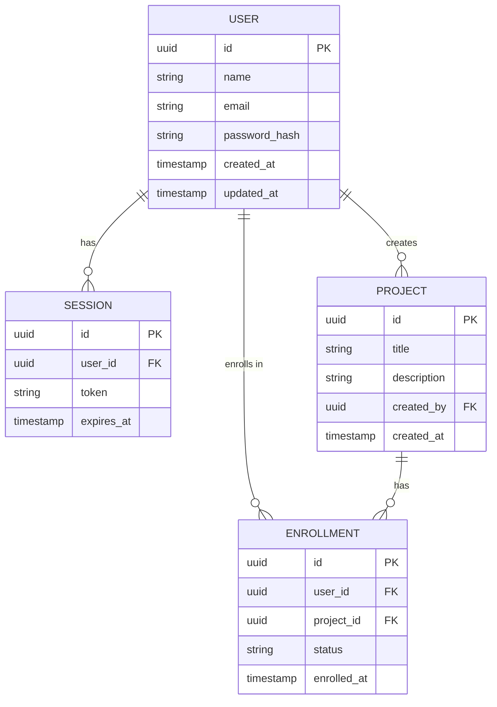
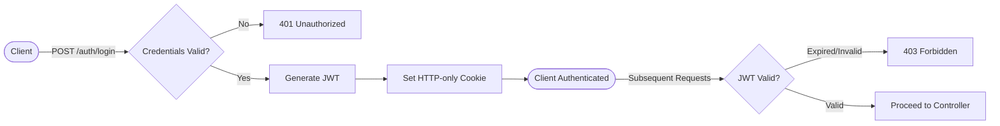
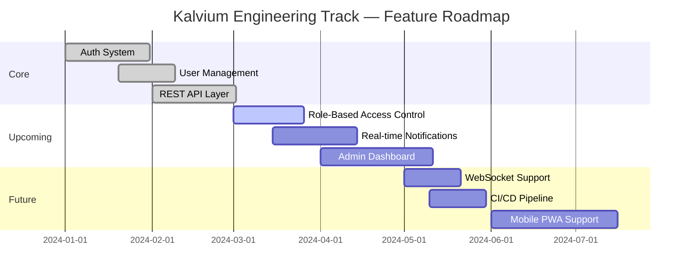
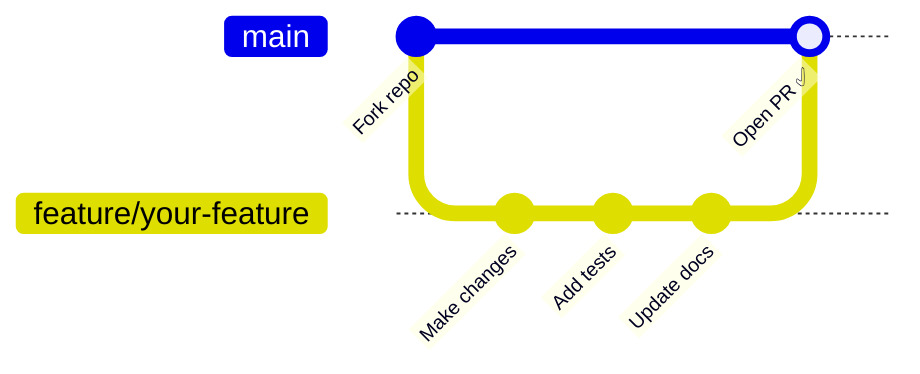

<div align="center">


<br/>

[](https://github.com/hardikkaurani/Kalvium-Project-Engineering-Track/stargazers)
[](https://github.com/hardikkaurani/Kalvium-Project-Engineering-Track/network/members)
[](https://github.com/hardikkaurani/Kalvium-Project-Engineering-Track/issues)
[](LICENSE)
[](CONTRIBUTING.md)

<br/>

> **A production-grade, hands-on engineering track designed to transform learners into industry-ready software engineers — through real projects, real decisions, and real code.**

<br/>

[🚀 Get Started](#-quick-start) · [📖 Docs](#-api-documentation) · [🤝 Contribute](#-contributing) · [🐛 Report Bug](https://github.com/hardikkaurani/Kalvium-Project-Engineering-Track/issues)

</div>

---

## 📑 Table of Contents

- [✨ About the Project](#-about-the-project)
- [⚙️ Tech Stack](#️-tech-stack)
- [🏗️ Architecture](#️-architecture)
- [🗂️ Project Structure](#️-project-structure)
- [🚀 Quick Start](#-quick-start)
- [🔐 Environment Variables](#-environment-variables)
- [📖 API Documentation](#-api-documentation)
- [🧪 Testing](#-testing)
- [🐳 Docker Setup](#-docker-setup)
- [🗺️ Roadmap](#️-roadmap)
- [🤝 Contributing](#-contributing)
- [📄 License](#-license)

---

## ✨ About the Project

The **Kalvium Project Engineering Track** is a structured, industry-aligned learning framework that puts you in the driver's seat of a real-world full-stack application. Instead of toy tutorials, you work on:

- 🔨 **Production-grade codebases** with clean architecture patterns
- 🧠 **Real engineering decisions** — database design, API contracts, service boundaries
- 🤝 **Collaborative workflows** — PRs, code reviews, branching strategies
- 🚢 **End-to-end delivery** — from local dev to containerized cloud deployment

Whether you're just starting your engineering journey or leveling up from fundamentals, this track is built to bridge the gap between _learning_ and _doing_.

---

## ⚙️ Tech Stack

<div align="center">

| Layer | Technology | Purpose |
|---|---|---|
| 🖥️ Frontend |  | UI, state management, routing |
| 🔧 Backend |   | REST API, middleware, auth |
| 🗄️ Database |   | Relational + document data |
| 🧪 Testing |   | Unit, integration, e2e tests |
| 🐳 DevOps |   | Containerization & deployment |

</div>

---

## 🏗️ Architecture

The system follows a **layered microservices architecture** with clear separation of concerns. Each layer has a single responsibility and communicates through well-defined interfaces.

### 🔄 System Overview



### 🔁 Request Lifecycle



### 🧩 Entity Relationship Diagram



### 🔐 Authentication Flow



---

## 🗂️ Project Structure

```
kalvium-engineering-track/
│
├── 📁 client/                     # React Frontend
│   ├── public/
│   ├── src/
│   │   ├── components/            # Reusable UI components
│   │   ├── hooks/                 # Custom React hooks
│   │   ├── context/               # Global state (Context API)
│   │   ├── pages/                 # Route-level page components
│   │   ├── services/              # API call abstractions
│   │   └── App.jsx
│   └── package.json
│
├── 📁 server/                     # Node.js + Express Backend
│   ├── src/
│   │   ├── routes/                # Express route definitions
│   │   ├── controllers/           # Request/response handlers
│   │   ├── services/              # Business logic layer
│   │   ├── models/                # DB schema & query models
│   │   ├── middlewares/           # Auth, validation, logging
│   │   └── index.js
│   └── package.json
│
├── 📁 tests/                      # Test suites (Jest + Mocha)
│   ├── unit/
│   └── integration/
│
├── 📁 docker/                     # Dockerfiles per service
├── 🐳 docker-compose.yml          # Full stack orchestration
├── 📄 .env.example                # Environment variable template
└── 📄 README.md
```

---

## 🚀 Quick Start

### Prerequisites

Make sure you have the following installed:

```bash
node --version    # v18+ recommended
npm --version     # v9+
docker --version  # v24+
git --version     # any recent version
```

### Installation

**1. Clone the repository**
```bash
git clone https://github.com/hardikkaurani/Kalvium-Project-Engineering-Track.git
cd Kalvium-Project-Engineering-Track
```

**2. Install dependencies**
```bash
# Backend
cd server && npm install

# Frontend
cd ../client && npm install
```

**3. Configure environment variables**
```bash
cp .env.example .env
# Edit .env with your local config
```

**4. Start with Docker (recommended)**
```bash
docker-compose up --build
```

Or run services separately in dev mode:
```bash
# Terminal 1 — Backend
cd server && npm run dev

# Terminal 2 — Frontend
cd client && npm start
```

**5. Open in browser**
```
Frontend → http://localhost:3000
Backend  → http://localhost:5000
```

---

## 🔐 Environment Variables

Create a `.env` file in the root. Refer to `.env.example` for all required keys:

| Variable | Description | Example |
|---|---|---|
| `PORT` | Server port | `5000` |
| `NODE_ENV` | Environment mode | `development` |
| `DB_HOST` | PostgreSQL host | `localhost` |
| `DB_PORT` | PostgreSQL port | `5432` |
| `DB_NAME` | Database name | `kalvium_db` |
| `DB_USER` | DB username | `postgres` |
| `DB_PASS` | DB password | `yourpassword` |
| `MONGO_URI` | MongoDB connection string | `mongodb://localhost:27017/kalvium` |
| `JWT_SECRET` | Secret key for JWTs | `supersecretkey` |
| `JWT_EXPIRES_IN` | Token expiry duration | `7d` |

> ⚠️ **Never commit your `.env` file to version control.**

---

## 📖 API Documentation

Base URL: `http://localhost:5000/api`

### 🔑 Authentication

| Method | Endpoint | Description | Auth Required |
|---|---|---|---|
| `POST` | `/auth/signup` | Register a new user | ❌ |
| `POST` | `/auth/login` | Login and receive JWT | ❌ |
| `POST` | `/auth/logout` | Invalidate session | ✅ |

**Example — Signup Request:**
```json
POST /api/auth/signup
{
  "name": "Hardik Kaurani",
  "email": "hardik@kalvium.com",
  "password": "securepassword123"
}
```

**Example — Signup Response:**
```json
{
  "success": true,
  "message": "User registered successfully",
  "token": "eyJhbGciOiJIUzI1NiIs..."
}
```

### 👤 Users

| Method | Endpoint | Description | Auth Required |
|---|---|---|---|
| `GET` | `/users` | Get all users | ✅ |
| `GET` | `/users/:id` | Get user by ID | ✅ |
| `PUT` | `/users/:id` | Update user profile | ✅ |
| `DELETE` | `/users/:id` | Delete a user | ✅ Admin |

**Status Codes Reference:**

| Code | Meaning |
|---|---|
| `200` | OK — Request successful |
| `201` | Created — Resource created |
| `400` | Bad Request — Validation failed |
| `401` | Unauthorized — JWT missing/invalid |
| `403` | Forbidden — Insufficient permissions |
| `404` | Not Found — Resource doesn't exist |
| `500` | Internal Server Error |

---

## 🧪 Testing

The project uses **Jest** for unit tests and **Mocha** for integration tests.

```bash
# Run all tests
npm test

# Unit tests only
npm run test:unit

# Integration tests only (ensure services are running first)
npm run test:integration

# With coverage report
npm run test:coverage
```

Coverage thresholds are enforced in `jest.config.js`. Aim for **>80% coverage** on all new features.

---

## 🐳 Docker Setup

The app is fully containerized. Each service has its own `Dockerfile` and they're orchestrated via `docker-compose.yml`.

```bash
# Build and start all services
docker-compose up --build

# Run in detached mode
docker-compose up -d

# Stop all containers
docker-compose down

# View logs
docker-compose logs -f server

# Rebuild a single service
docker-compose up --build server
```

**Services in docker-compose:**

| Service | Port | Description |
|---|---|---|
| `client` | `3000` | React dev server |
| `server` | `5000` | Express API |
| `postgres` | `5432` | PostgreSQL database |
| `mongo` | `27017` | MongoDB instance |

---

## 🗺️ Roadmap



---

## 🤝 Contributing

Contributions are what make open source amazing. Here's how to get involved:



### Step-by-step

1. **Fork** the repository
2. **Create** your feature branch: `git checkout -b feature/amazing-feature`
3. **Commit** with clear messages: `git commit -m "feat: add amazing feature"`
4. **Push** your branch: `git push origin feature/amazing-feature`
5. **Open** a Pull Request with a description of what & why

### Commit Convention

We follow [Conventional Commits](https://www.conventionalcommits.org/):

| Prefix | Use for |
|---|---|
| `feat:` | New feature |
| `fix:` | Bug fix |
| `docs:` | Documentation update |
| `test:` | Adding or updating tests |
| `chore:` | Build process or tooling changes |
| `refactor:` | Code change that's not a bug fix or feature |

---

## 📄 License

Distributed under the **MIT License**. See [`LICENSE`](LICENSE) for more information.

---

<div align="center">

Made with ❤️ by [Hardik Kaurani](https://github.com/hardikkaurani) & the Kalvium community

⭐ If this project helped you, please give it a star!

</div>
